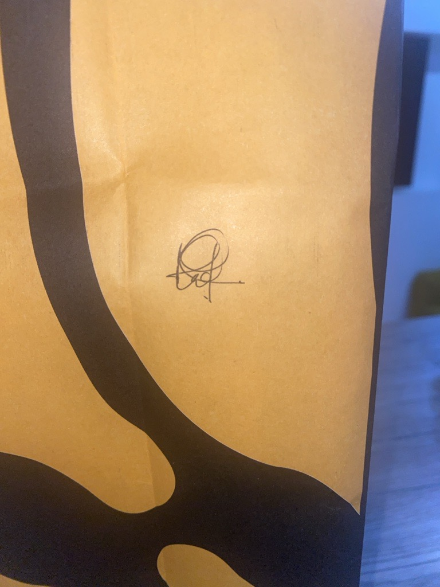

### **Signature Extraction**
This project focuses on extracting handwritten signatures from scanned document screenshots, or images taken normally using a rule-based image processing pipeline built entirely with OpenCV.
Note: Images are best taken with clear background and well positioned signature for recognition.

The process begins by generating a mask that highlights inked regions using contrast based identification. A smart cropping algorith then extracts the region of interest using the bounding box of the mask. This crop avoids capturing areas too close to the original image's full height and adjusts the shape to favor a wider, more rectangular region by applying calculated padding.

Once cropped, hierarchical contour detection is used to create an accurate signature mask. This approach preserves internal loops and strokes while removing the background. The final output is a transparent image containing only the signature with its structure intact.

An attempt was made to use a deep learning-based model (rembg, running on ONNX Runtime) for background removal, but the results were inconsistent for signature-specific tasks. The final solution avoids machine learning and relies entirely on deterministic image-based heuristics.

Example
Original Document → Extracted Signature

   

Dependencies (To install)
- `numpy`
- `opencv-python`
- `matplotlib (optional, for visualization)`
